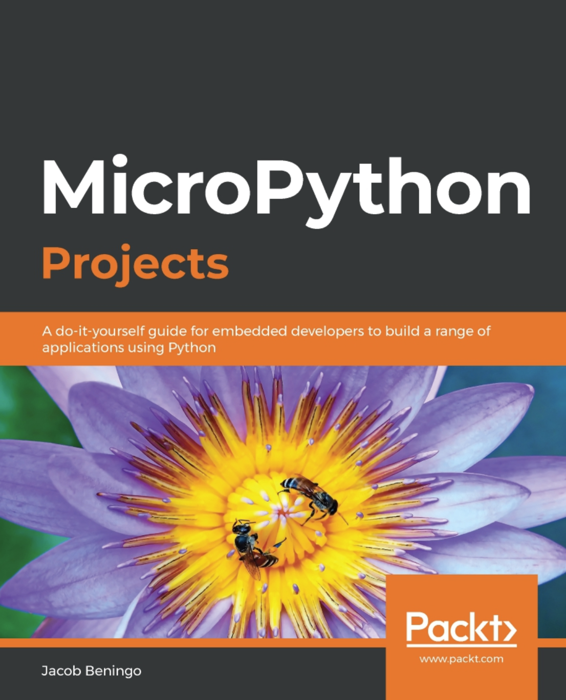
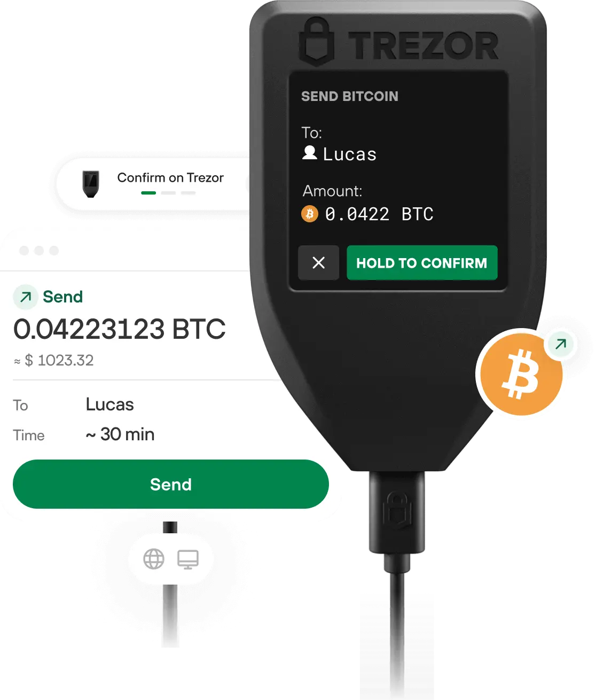
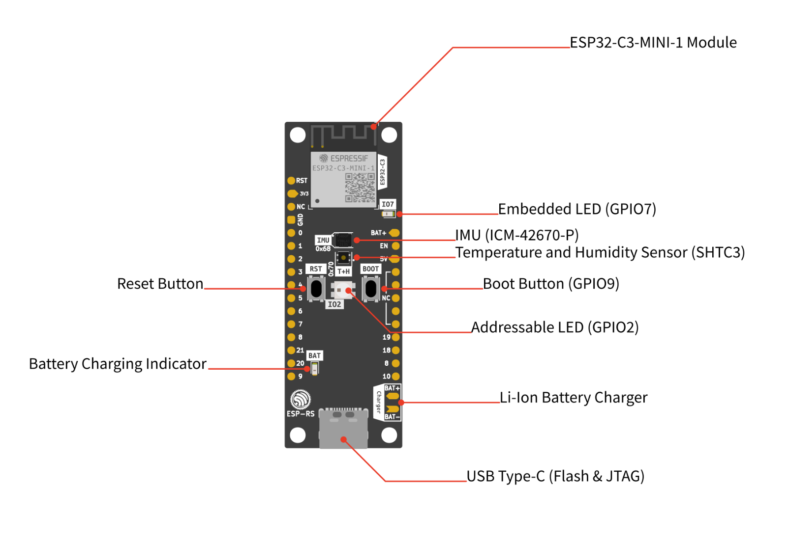

# Micropython on Espressif Chips (ESP32): A Practical Introduction

## Brněnské Pyvo - 23.02.2023

### _Sergei Silnov_

---


- Multinational fabless semiconductor company based in Shanghai, China
- Best known for ESP8266 and ESP32-family of chips
- European office in Brno, Czech Republic

Products: https://products.espressif.com/

---

## ESP32C3

- **CPU**: 32-bit RISC-V core at 160MHz
- **Memory**: 384KB ROM, 400KB SRAM and external QSPI flash support upto 16MB
- **Connectivity**: 2.4 GHz Wi-Fi b/g/n, BLE 5.0
- **Security**: Secure Boot, Flash Encryption, Crypto Accelerators, Digital Signature Peripheral
- **Peripherals**: 22 IOs, UART, SPI, I2C, I2S, PWM, ADC, TWAI

---

# What are popular high-level or interpreted languages for MCUs?

---

- Lua ([NodeMCU](https://github.com/nodemcu/nodemcu-firmware))
- JS ([Espruino](https://github.com/espruino/Espruino))
- Go ([TinyGo](https://tinygo.org/))
- Erlang/Elixir ([AtomVM](https://github.com/atomvm/AtomVM))
- Python (MicroPython, CircuitPython)

---

# Micropython 

vs

# CircuitPython 

---

## [Micropython](https://micropython.org/)

- Light and efficient: 256k of code space and 16k of RAM
- Core language: 3.4 + selected features from 3.5-3.10 (including async/await keywords)
- Lower level APIs - threading/interrupts
- Some APIs closer to CPython
- Supports ESP8266/ESP32/ESP32-S2/ESP32-S3/ESP32-C3 and many other chips

---

## [CircuitPython](https://circuitpython.org/)

- Developed by Adafruit and community
- Focused on educational use
- Unified API for all supported boards
- Flash over USB (or Bluetooth)
- Supports ESP32-S2/ESP-S3/ESP32-C3 and ESP32 in development

---

## Books

- [MicroPython Projects](https://packt.link/y3r3s)
- [Developing IoT projects with ESP32](https://packt.link/pIIXM)



---

## Is it any good?

---

## A mesh network implementation in pure micropython?

https://github.com/SestakJ/DP-Micropython-ESP32-Mesh

---

## A hardware wallet?

https://github.com/trezor/trezor-firmware



---

## ESP32-C3 development board


https://github.com/esp-rs/esp-rust-board

---

## Let's get started!

- `pip install -U esptool mpremote`
- Donwload firmware from https://micropython.org/download/esp32c3-usb/
- Flash it:
  `esptool.py --chip esp32c3 --port /dev/cu.usbmodem2101 --baud 460800 write_flash -z 0x0 esp32c3-usb-20220618-v1.19.1.bin`

---

## Now it's time to write some code!

Create `main.py` with the following content:

```python
import time

while True:
    print("Hello Brnenske PyVo!")
    time.sleep(1)
```

---

## And run it:

```bash
# Copy file to the board (boot.py and then main.py are executed automatically)
mpremote connect /dev/cu.usbmodem2101 cp  ./main.py :
# Reset the board
mpremote connect /dev/cu.usbmodem2101 reset
# And attach to the REPL
mpremote connect /dev/cu.usbmodem2101
```

For a comfy IDE flow, check out [micropy-cli](https://github.com/BradenM/micropy-cli)

---

## Blink an LED

```python
import time, neopixel;from machine import Pin;from math import sin, pi;

led_pin = Pin(2, Pin.OUT)
led = neopixel.NeoPixel(led_pin, 1)

while True:
    for i in range(360):
        led[0] = (
            abs(int(sin(i * pi / 180) * 64)),
            abs(int(sin((i + 45) * pi / 180) * 64)),
            abs(int(sin((i + 90) * pi / 180) * 64)),
        )
        led.write()
        time.sleep(0.01)
```

---

## Read button state (busy loop)

```python
from machine import Pin
import time

button = Pin(9, Pin.IN)

while True:
    if button.value() == 0:
        print("Button pressed")
    else:
        print("Button released")

    time.sleep(0.1)
```

---

## Read button state (interrupt)

```python
from machine import Pin

def button_callback(pin):
    print("Button pressed - IRQ")

button = Pin(9, Pin.IN)
button.irq(trigger=Pin.IRQ_FALLING, handler=button_callback)
```

---

## Read button state (asycnio)

```python
from machine import Pin
import uasyncio as asyncio

async def button_task():
    button = Pin(9, Pin.IN)
    while True:
        if button.value() == 0:
            print("Button pressed - Async")
            await asyncio.sleep(0.1)

asyncio.run(button_task())
```

---

## Offtopic: Testing and debugging

Solution: run the code on a PC

```python
try:
    import uasyncio as asyncio
except ImportError:
    import asyncio

...
```

---

## Debounce a button

```python
class Button:
    def __init__(self, pin, on_press, on_release, debounce_ms=50, off_state=None):
        ...
        self.raw_state = lambda self:  bool(self.pin.value() ^ self.off_state)
        self.state = self.raw_state()
        asyncio.create_task(self.update_state())

    async def update_state(self):
        while True:
            current_state = self.raw_state()
            if self.state != current_state:
                if current_state:
                    asyncio.create_task(self.on_press())
                else:
                    asyncio.create_task(self.on_release())
                self.state = current_state
            await asyncio.sleep_ms(self.debounce_ms)
```

---

## Debounce a button (cont.)

```python
async def press():
    print("Button pressed")

async def release():
    print("Button released")

async def main():
    button = Pin(9, Pin.IN)
    Button(button, on_press=press, on_release=release, off_state=True)

    # Keep alive
    while True:
        await asyncio.sleep(1)
```

---

# Connect to WiFi - station

```python
async def connect_wifi(ssid, password):
    import network

    wlan = network.WLAN(network.STA_IF)
    wlan.active(True)
    if not wlan.isconnected():
        wlan.connect(ssid, password)
        while not wlan.isconnected():
            await asyncio.sleep_ms(10)

    return wlan
```

to scan: `WLAN.scan()`

---

# Connect to WiFi - access point

```python
import network

async def connect_wifi(ssid, password):
    ap = network.WLAN(network.AP_IF)
    ap.active(True)
    # 3 – WPA2-PSK
    ap.config(essid=ssid, password=password, authmode=3)
    return ap

async def main():
    ap = await connect_wifi(ssid, password)
    print("IP:", ap.ifconfig()[0])
```

---

## Install a web framework

[Microdot](https://github.com/miguelgrinberg/microdot) is a web framework similar to Flask

```

mpremote connect /dev/cu.usbmodem2101 cp ./microdot/src/microdot.py :
mpremote connect /dev/cu.usbmodem2101 cp ./microdot/src/microdot_asyncio.py :

```

---

## Start a web server

```python
from microdot_asyncio import Microdot

a = 1
app = Microdot()

@app.route("/")
async def hello(request):
    return "<html><body>{}</body></html>".format(a), 200, {"Content-Type": "text/html"}

asyncio.create_task(app.start_server(port=5000))
```

---

# Glue it all together

_Demo time_

---

# Optimizations: Performance

- Pre-compile byte code
- Less abstractions
- Use local variables instead of globals
- Avoid floating point math
- Rewrite in C (or Rust)

---

# Optimizations: Memory

- `gc.collect()`
  - Avoids fragmentation
  - Avoids delays
- `array.array` and `memoryview`

---

## Thank you!

Questions?

These slides are available at
https://github.com/kumekay/talks
