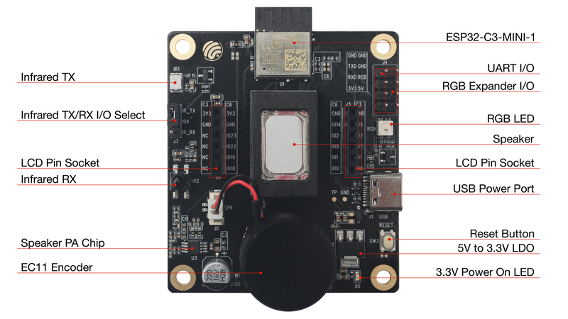
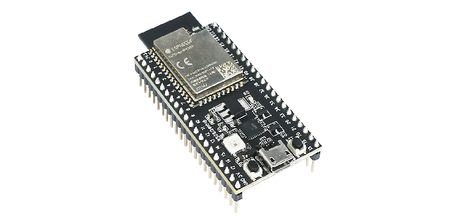

# Jednoduché dálkové ovládání s MicroPythonem a ESP-NOW

Simple remote control with MicroPython and ESP-NOW

## ESP Community Meeting Brno - 20.10.2023

### _Sergei Silnov_

---

## ESP32C3 LCD Kit



[Kit Docs](https://docs.espressif.com/projects/espressif-esp-dev-kits/en/latest/esp32c3/esp32-c3-lcdkit/)

---

## ESP32-S2-Saola-1



---

## Demo time!

---

# ESP-NOW

ESP-NOW is a connection-less wireless communication protocol supporting:

- Direct communication between up to 20 registered peers:
- Encrypted and unencrypted communication (up to 6 encrypted peers)
- Message sizes up to 250 bytes,
- Can operate alongside Wi-Fi (network.WLAN)

---

# Micropython 

vs

# CircuitPython 

---

## [Micropython](https://micropython.org/)

- Light and efficient: 256k of code space and 16k of RAM
- Core language: 3.4 + selected features from 3.5-3.10 (including async/await keywords)
- Lower level APIs - threading/interrupts
- Some APIs closer to CPython
- Supports ESP8266/ESP32/ESP32-S2/ESP32-S3/ESP32-C3 and many other chips

---

## [CircuitPython](https://circuitpython.org/)

- Developed by Adafruit and the community
- Focused on educational use
- Unified API for all supported boards
- Flash over USB storage (or Bluetooth)
- Supports ESP32-S2/ESP-S3/ESP32-C3 and ESP32 in development

---

## Lets' flash it first

- `pip install -U esptool mpremote`
- Download firmware from https://micropython.org/download/ESP32_GENERIC_S2/
- Flash it:
  `esptool.py --chip esp32s2 --port /dev/tty.usbserial-210 write_flash 0x1000 ESP32_GENERIC_S2-20231005-v1.21.0.bin`

---

## And run it:

```bash
# Copy file to the board (boot.py and then main.py are executed automatically)
mpremote connect /dev/cu.usbserial-210 cp  ./main.py :
# Reset the board
mpremote connect /dev/cu.usbserial-210 reset
# And attach to the REPL
mpremote connect /dev/cu.usbserial-210
```

---

## Init LED

```python
from machine import Pin
import neopixel

LED_PIN = 18

def set_color(led, rgb):
    led[0] = rgb
    led.write()
    print("RGB: ", rgb)

async def main():
    led_pin = Pin(LED_PIN, Pin.OUT)
    led = neopixel.NeoPixel(led_pin, 1)

    ...
```

---

## Listen for packets

```python
import espnow; import network; import json

def main():
    sta = network.WLAN(network.STA_IF)
    sta.active(True)

    enow = espnow.ESPNow()
    enow.active(True)

    while True:
        _host, msg = enow.recv()
        if msg:  # msg == None if timeout in recv()
            rgb = json.loads(msg.decode("utf-8"))
            set_color(led, rgb)
```

---

## More things at a time

```python
import aioespnow

async def main():
    ...
    enow = aioespnow.AIOESPNow()
    enow.active(True)
    await asyncio.create_task(listener(enow, led))

async def listener(enow, led):
    async for _mac, msg in enow:
        rgb = json.loads(msg.decode("utf-8"))
        set_color(led, rgb)
```

---

## How the does the receiver know that the packet is for it?

```python
# Broadcast address
PEER = b"\xbb\xbb\xbb\xbb\xbb\xbb"

async def send_color(enow, rgb):
    await enow.asend(PEER, json.dumps(rgb))

async def main():
    enow = aioespnow.AIOESPNow()
    enow.active(True)
    enow.add_peer(PEER)
```

---

## Is it safe?

`ESPNow.add_peer()`

accepts a MAC address and a key. The key is used to encrypt the data sent to the peer. The key must be 16 bytes long.

---

## HMAC

Hash-based message authentication code can help

```bash
mpremote connect /dev/tty.usbserial-210 mip install hmac
```

---

```python
import hmac
import hashlib

KEY = b"secret plaintext key"

async def listener(enow, led):
    async for _mac, msg in enow:
        data = json.loads(msg.decode("utf-8"))
        code = data.get("hmac")
        rgb = data.get("rgb")
        rgb_json = json.dumps(data.get("rgb")).encode("utf-8")
        if hmac.new(KEY, rgb_json, hashlib.sha256).hexdigest() != code:
            print("Invalid HMAC")
            continue

        set_color(led, rgb)
```

NB: There is no `compare_digest` in Micropython

---

## Out of scope

- Error handling
- Signal strength
- Sleep modes

---

## Thank you!

Questions?

- Official documentation: https://docs.micropython.org/en/latest/library/espnow.html
- Slides: https://github.com/kumekay/talks/tree/main/micropython_espnow


