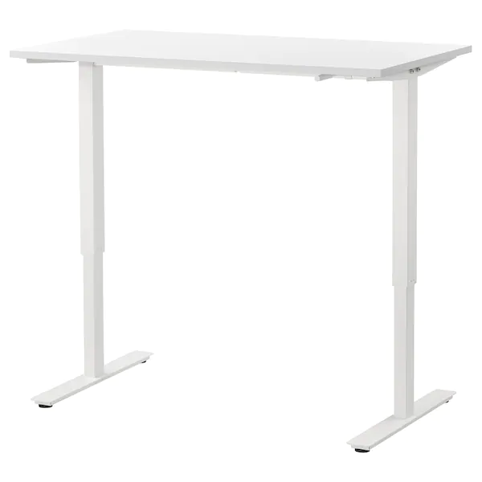
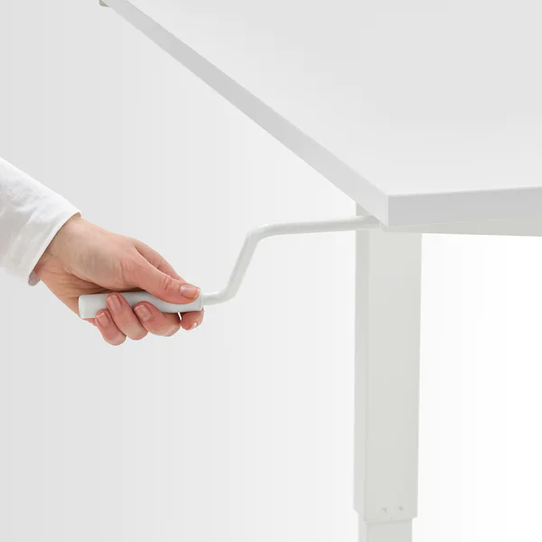
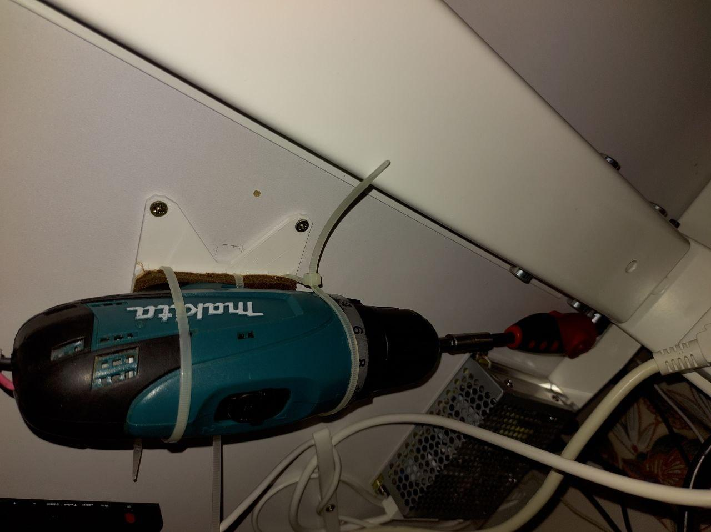

# Friday Technology talk - _Sergei Silnov_ - 24.09.2021

## Practical micropython with uasyncio for ESP32

---

## [Micropython](https://micropython.org/)

- light and efficient: 256k of code space and 16k of RAM
- core language: 3.4 + selected features from 3.5/3.6/3.7 (including async/await keywords)
- some parts of standard library
- micropython specific and port specific libraries

---

## Nice things

- Supports all Espressif chips: esp8266/esp32/s2/c3/s3
- REPL / Web REPL / mpremote
- pre-compiled MPY-files
- MPY files with native code

---

## Let's hello blink

- Download from https://micropython.org/download/esp32/
- Flash
  `esptool.py --chip esp32 --port /dev/ttyUSB0 write_flash -z 0x1000 esp32-20180511-v1.9.4.bin`
- `pip install mpremote`

---

## Let's solve a real problem

---



---



---



---

## The Motor Control

- An ESP32 devkit
- 2 push buttons
- H-Bridge BTS7960B

---

## Debounced button class

```python
class Button:
    def __init__(self, pin, on_press, on_release, debounce_ms=50, off_state=True):
        self.pin = pin
        self.on_press = on_press
        self.on_release = on_release
        self.debounce_ms = debounce_ms
        self.off_state = off_state
        self.state = self.raw_state()

        asyncio.create_task(self.update_state())

    def raw_state(self):
        return bool(self.pin.value() ^ self.off_state)

    async def update_state(self):
        while True:
            current_state = self.raw_state()
            if self.state != current_state:
                if current_state:
                    asyncio.create_task(self.on_press())
                else:
                    asyncio.create_task(self.on_release())
                self.state = current_state

            await asyncio.sleep_ms(self.debounce_ms)

Button(BUTTON_DOWN, on_press=down, on_release=stop, off_state=True)
```

---

## Control speed

```python
from machine import PWM
...
PWMS = [PWM(pin, freq=20000, duty=0) for pin in PWM_PINS]
...
duty = 400
async def move(up=False):
    print("moving {} @ {}".format("up" if up else "down", duty))
    PWMS[int(up)].duty(duty)

async def down():
    await move(up=False)

async def up():
    await move(up=True)

async def stop():
    print("stop")
    for pwm in PWMS:
        pwm.duty(0)
```

---

```python
class Motor:
    def __init__(self):
        self.direction = 0

    async def move(self, up=False):
        if self.direction == 0:
            self.direction = 1 if up else -1
            PWMS[int(up)].duty(duty)

    async def down(self):
        await self.move(up=False)

    async def up(self):
        await self.move(up=True)

    async def stop(self):
        for pwm in PWMS:
            pwm.duty(0)
        self.direction = 0

    async def stop_down(self):
        if self.direction == -1:
            await self.stop()

    async def stop_up(self):
        if self.direction == 1:
            await self.stop()

```

---

## Smooth speed control

```python
async def move(self, up=False):
    if self.direction == 0:
        self.direction = 1 if up else -1
        for duty in range(400, 950, 50):
            PWMS[int(up)].duty(duty)
            await asyncio.sleep_ms(100)
            print("moving {} @ {}".format("up" if up else "down", duty))
```

---

## Synchronization Primitives

- `Lock` - can be used in an `async with` statement
- `Event` - to notify multiple asyncio tasks about an event
- `ThreadSafeFlag` - to sync with other threads and IRQ

---

# Let's check the final code

---

## Useful links

- These slides: https://github.com/kumekay/talks
- micropython github: https://github.com/micropython/micropython
- micropython docs: https://docs.micropython.org/en/latest/
- micropython forum: https://forum.micropython.org/
