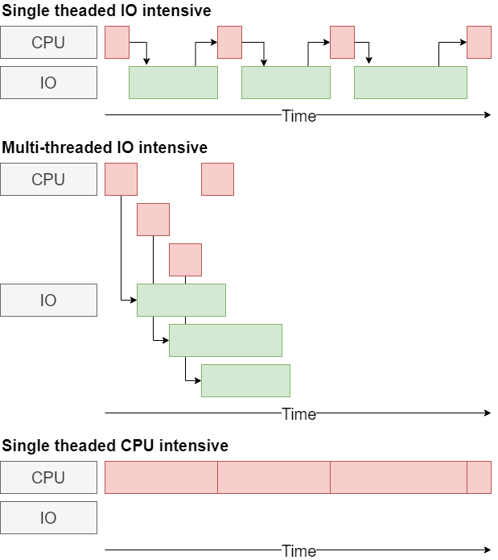

# Friday Technology talk - _Sergei Silnov_ - 06.08.2021

## Concurrency and parallelism in Python

What to do if a single thread is not enough

---

# Concurrency vs parallelism

- Parallelism is about **doing** many things simultaneously
- Concurrency is about **dealing** with many things simultaneously

---

# Let's download some cat photos

Start the cat server

```
docker run --rm -p 8000:80 -v $(pwd)/cats:/usr/share/nginx/html:ro nginx
```

---

# Naive approach

```python
import timeit
import urllib.request

def download_cat(cat_id, n=5):
    for _ in range(n):
        with urllib.request.urlopen(f"http://localhost:8000/{cat_id}.jpg") as response:
            response.read()


def down_them_all():
    [download_cat(n+1) for n in range(20)]


if __name__ == "__main__":
    time = timeit.timeit(down_them_all, number=10)
    print(f"Duration {time} seconds")
```

Duration **1.3388052999507636** seconds

---

# Add some threads!

```python
...

import concurrent.futures

...

def down_them_all():
    # python 3.2+ only
    # python 2.7 will require traditional thread.start()/thread.join()
    # and thread-safe structure for thread pool, like `Queue`
    with concurrent.futures.ThreadPoolExecutor(max_workers=5) as runner:
        runner.map(download_cat, range(1, 21))

```

Duration **0.7045268000802025** seconds

---

# State to share

```python
...

import requests
import threading

thread_local = threading.local()


def download_cat(cat_id, n=5):
    try:
        session = thread_local.session
    except AttributeError:
        session = requests.Session()

    for _ in range(n):
        with session.get(f"http://localhost:8000/{cat_id}.jpg") as response:
            response.content

...
```

---

# asyncio and async/await

- preemptive multitasking vs cooperative multitasking
- `asyncio` - a package to run and manage coroutines
- `async`/`await` - coroutines
- It's not that simple

---

# async cat downloader

```python
import time
import asyncio
import aiohttp #  https://github.com/aio-libs

# async/await is python 3.5+
async def download_cat(cat_id, n=5):
    async def download_one():
        async with aiohttp.ClientSession() as session:
            async with session.get(f"http://localhost:8000/{cat_id}.jpg") as response:
                await response.read()

    await asyncio.gather(*[download_one() for _ in range(n)])


async def down_them_all():
    await asyncio.gather(*[download_cat(n + 1) for n in range(20)])


if __name__ == "__main__":
    start = time.time()
    # python 3.7+
    asyncio.run(down_them_all())
    # python 3.4+
    # loop = asyncio.get_event_loop()
    # loop.run_until_complete(main())

    duration = time.time() - start
    print(f"Duration {duration} seconds")
```

Duration **0.725578784942627** seconds

---

# Different kinds of loads

- IO-bound
- CPU-bound

---

# Compute intensive task

```python
import timeit
import hashlib
from uuid import uuid4

def hash_me(n=500_000):
    data = uuid4().bytes
    for _ in range(n):
        data = hashlib.sha256(data).digest()

def calc_them_all():
    [hash_me() for _ in range(20)]

if __name__ == "__main__":
    time = timeit.timeit(calc_them_all, number=1)
    print(f"Duration {time} seconds")
```

Duration **4.832652900018729** seconds

---

# Threads should make it faster!

```python
import concurrent.futures

...

def calc_them_all():
    with concurrent.futures.ThreadPoolExecutor(max_workers=5) as runner:
        [runner.submit(hash_me) for _ in range(20)]

...
```

Duration **6.00608059996739** seconds

---

# What?



---

# GIL - Global Interpreter Lock

- Simple implementation of the reference counter, no delays for garbage collection
- Good single-threaded performance
- Easy to add C extension in a thread-safe way
- 1 thread at a time (in most cases)

---

# Processes

```python
def calc_them_all():
    # python 3.2+ only
    # For python 2.7 `multiprocessing.Pool` should be used instead
    with concurrent.futures.ProcessPoolExecutor(max_workers=5) as runner:
        [runner.submit(hash_me) for _ in range(20)]
```

Duration **1.9086538000265136** seconds

---

# Beyond the Standard Library and CPython

- PyPy https://www.pypy.org/
- Event-based https://twistedmatrix.com/trac/
- Reactive architecture (Observer pattern) https://github.com/ReactiveX/RxPY
- More than one machine http://celeryproject.org/
- Use python only for control: https://pytorch.org/ and https://www.tensorflow.org/

_thanks https://unsplash.com/ for the cats_
